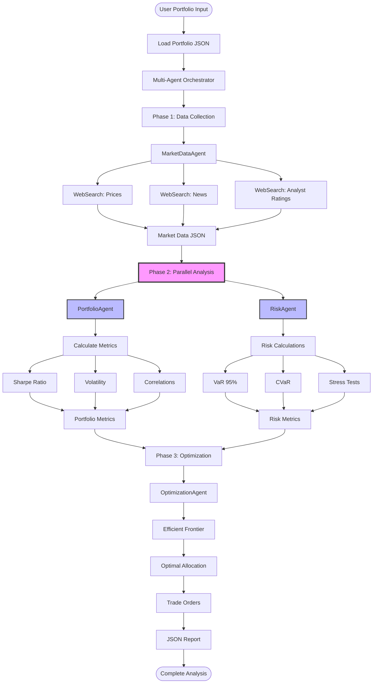
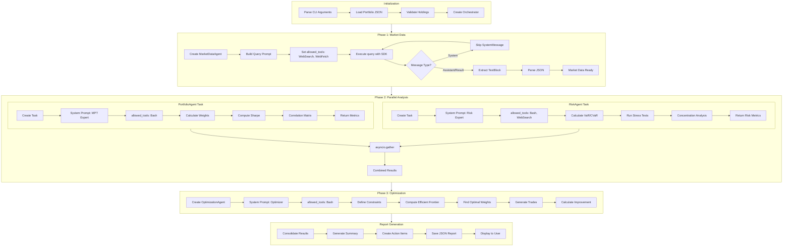
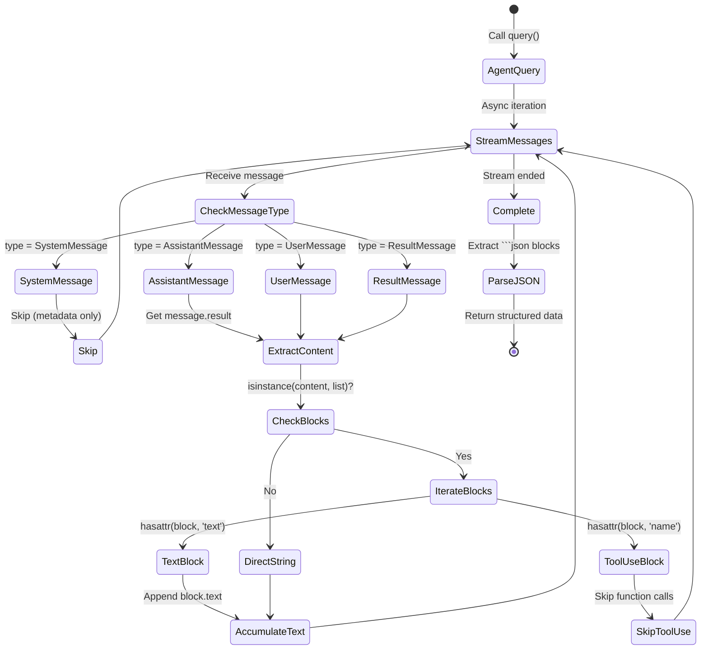
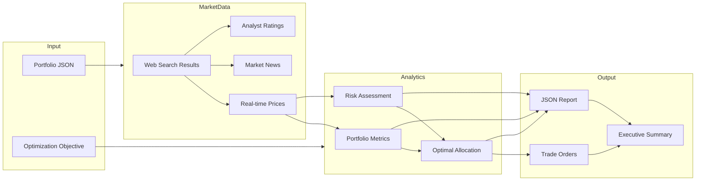
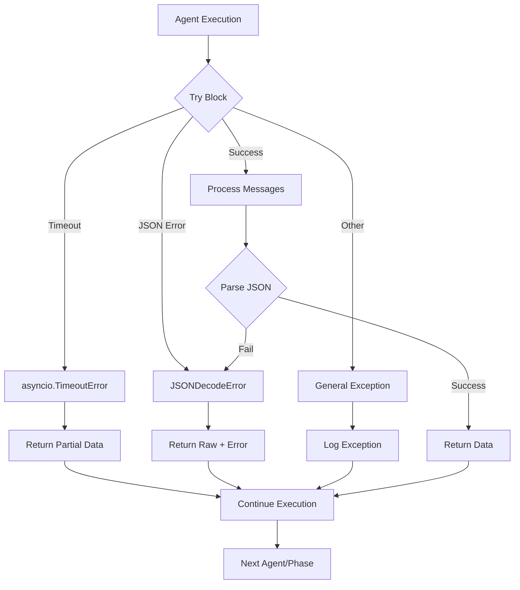
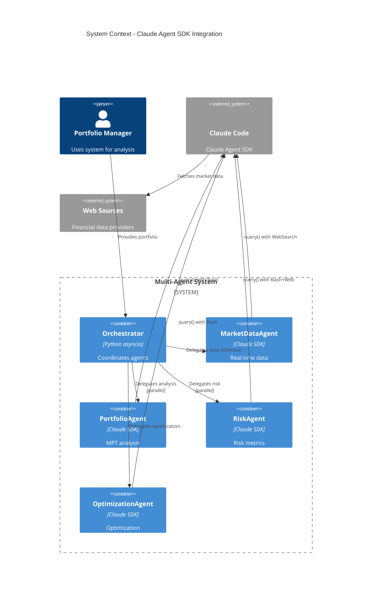

# System Architecture - Process Diagrams

## High-Level System Flow



## Detailed Agent Execution Flow



## Agent Message Processing Pipeline



## Data Flow Through System



## Parallel Execution Timeline

```mermaid
gantt
    title Multi-Agent Analysis Timeline
    dateFormat X
    axisFormat %L
    
    section Phase 1
    Load Portfolio         :p1, 0, 5
    MarketDataAgent       :p2, 5, 50
    
    section Phase 2 (Parallel)
    PortfolioAgent        :p3, 55, 35
    RiskAgent             :p4, 55, 40
    
    section Phase 3
    Wait for Phase 2      :p5, 95, 1
    OptimizationAgent     :p6, 96, 30
    
    section Reporting
    Generate Report       :p7, 126, 10
    Display Results       :p8, 136, 5
```



## Error Handling Flow



## SDK Integration Architecture



## Key Design Patterns

### 1. Agent Specialization
Each agent has:
- Dedicated `system_prompt` defining expertise
- Constrained `allowed_tools` for security
- Specific output schema

### 2. Parallel Execution
```python
# Phase 2: Portfolio and Risk run simultaneously
portfolio_task = asyncio.create_task(portfolio_agent.analyze(...))
risk_task = asyncio.create_task(risk_agent.assess(...))

# Wait for both to complete
results = await asyncio.gather(portfolio_task, risk_task)
```

### 3. Message Filtering
```python
for message in query(...):
    if 'System' in type(message).__name__:
        continue  # Skip metadata
    
    if isinstance(content, list):
        for block in content:
            if hasattr(block, 'text'):
                accumulate(block.text)
```

### 4. Timeout Safety
```python
async with asyncio.timeout(120):  # 2-minute max
    async for message in query(...):
        process(message)
```

## Performance Characteristics

- **Sequential Execution:** ~150s total
- **With Parallel Phase 2:** ~90s total
- **Speedup:** 1.67x
- **Bottleneck:** Market data collection (synchronous web searches)

## Future Enhancements

1. **Phase 1 Parallelization**: Split market data by symbol
2. **Caching Layer**: Cache market data for repeated analyses
3. **Streaming UI**: Real-time progress updates
4. **MCP Integration**: Custom financial data tools
